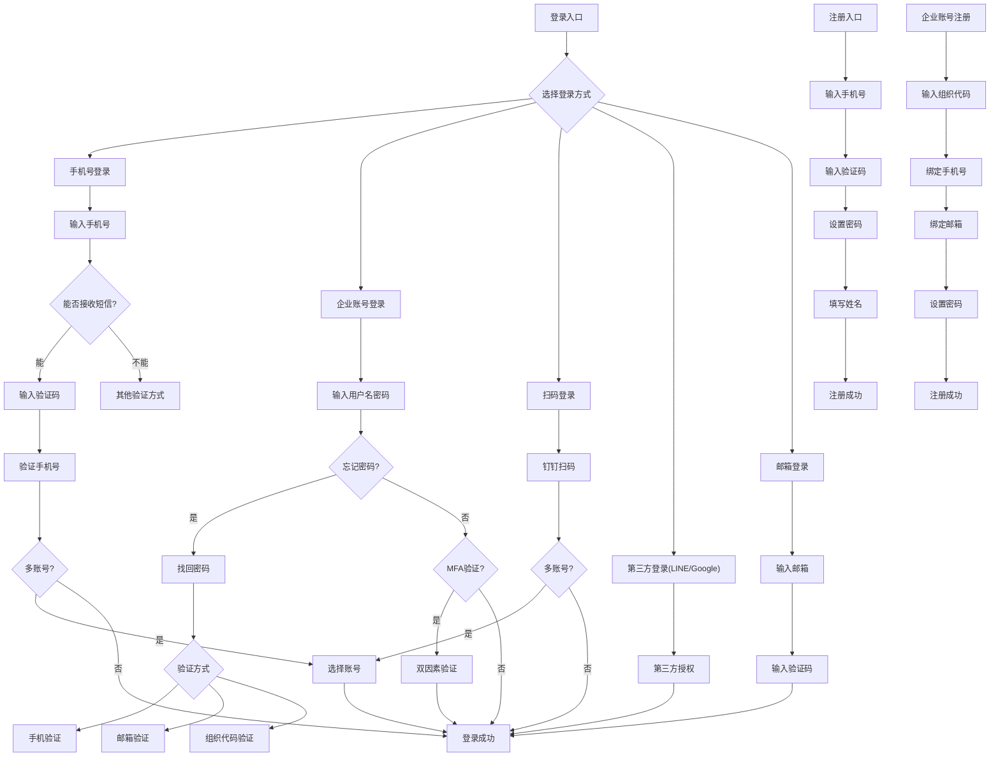

## 1. 产品概述

钉钉登录注册系统可交互需求文档——将钉钉登录/注册系统的完整需求以可交互、可导航的网页形式呈现，支持页面间流程跳转、UI截图预览、交互状态模拟，让产品、设计、开发团队直观理解整个登录注册体系。

- 目标用户：产品经理、设计师、开发工程师
- 核心价值：以可视化、可交互的方式替代静态文档，降低沟通成本，提升需求理解效率

## 2. 核心功能

### 2.1 功能模块

1. **导航首页**：系统全景图，展示所有页面节点及流程关系
2. **页面详情页**：每个登录/注册页面的需求说明、UI截图、交互说明
3. **流程模拟器**：可点击模拟用户操作路径，体验完整登录/注册流程

### 2.2 页面详情

| 页面名称 | 模块名称 | 功能描述 |
|----------|----------|----------|
| 导航首页 | 流程全景图 | 展示所有页面节点及连线，可点击跳转 |
| 导航首页 | 页面列表 | 按分类展示所有页面卡片，含缩略图和简介 |
| 页面详情页 | UI截图展示 | 展示需求文档中的UI截图 |
| 页面详情页 | 需求说明 | 展示页面功能需求、交互规则、异常处理 |
| 页面详情页 | 流程跳转 | 展示当前页面的上下游页面，可点击跳转 |
| 流程模拟器 | 步骤导航 | 按流程逐步展示页面，模拟用户操作 |

## 3. 核心流程

### 3.1 登录主流程

用户打开应用 → 选择登录方式 → 输入凭证 → 验证身份 → 登录成功

### 3.2 注册主流程

用户选择注册 → 输入手机号/邮箱 → 验证 → 设置密码 → 填写信息 → 注册成功

### 3.3 流程关系图

## 4. 用户界面设计

### 4.1 设计风格

- **主色调**：钉钉蓝 #0089FF，辅以深灰 #1F2329 和浅灰 #F5F6F7
- **按钮风格**：圆角8px，主按钮蓝色填充，次按钮灰色描边
- **字体**：标题使用 PingFang SC Medium，正文使用 PingFang SC Regular
- **布局风格**：左侧导航栏 + 右侧内容区，卡片式布局
- **图标风格**：线性图标，2px描边

### 4.2 页面设计概览

| 页面名称 | 模块名称 | UI元素 |
|----------|----------|--------|
| 导航首页 | 流程全景图 | 交互式流程图，节点可点击，连线带动画 |
| 导航首页 | 页面分类卡片 | 卡片网格布局，含缩略图、标题、简介 |
| 页面详情页 | UI截图 | 居中展示，支持放大查看 |
| 页面详情页 | 需求文本 | 左侧目录锚点，右侧内容滚动 |
| 页面详情页 | 流程跳转按钮 | 底部固定，前后页面快速切换 |
| 流程模拟器 | 手机模拟框 | 居中手机框，内嵌页面截图和操作按钮 |

### 4.3 响应式设计

- 桌面优先设计，最小宽度1200px
- 平板适配：导航栏折叠为汉堡菜单
- 移动端适配：单列布局，卡片全宽

## 5. 页面清单与UI链接

### 5.1 登录模块

| 页面 | UI截图链接 |
|------|-----------|
| 企业账号欢迎页 | https://img.alicdn.com/imgextra/i3/O1CN01aMcy4s221zhlAyf4y_!!6000000007061-2-tps-1370-996.png |
| 绑定手机号 | 需求文档内嵌截图 |
| 绑定邮箱 | 需求文档内嵌截图 |
| 设置密码 | 需求文档内嵌截图 |
| 登录主页 | https://img.alicdn.com/imgextra/i1/O1CN01v6jywp1rIWE1SmLzB_!!6000000005608-tps-144-144.png |
| 手机号能否接收短信 | 需求文档内嵌截图 |
| 找回账号密码 | 需求文档内嵌截图 |
| 忘记登录名 | 需求文档内嵌截图 |
| 组织代码登录 | 需求文档内嵌截图 |
| 钉钉扫码登录 | https://img.alicdn.com/imgextra/i1/O1CN01nbCqSO1dfV3JNFq7F_!!6000000003763-tps-600-360.png |
| LINE登录 | https://img.alicdn.com/imgextra/i4/O1CN01eBY5cL1QWGRr6HT4W_!!6000000001983-tps-40-40.png |
| Google登录 | https://img.alicdn.com/imgextra/i3/O1CN01IoEYKD1ovV373aMUZ_!!6000000005287-tps-40-40.png |
| DingDing国际版 | https://img.alicdn.com/imgextra/i3/O1CN019WsmfO1k00v40Ekbf_!!6000000004620-tps-309-120.png |

### 5.2 注册模块

| 页面 | UI截图链接 |
|------|-----------|
| 注册账号-输入手机号 | 需求文档内嵌截图 |
| 注册账号-设置密码 | 需求文档内嵌截图 |
| 创建组织 | 需求文档内嵌截图 |

### 5.3 验证与安全模块

| 页面 | UI截图链接 |
|------|-----------|
| 验证手机号码 | 需求文档内嵌截图 |
| MFA双因素验证 | 需求文档内嵌截图 |
| 多账号选择 | 需求文档内嵌截图 |
| 家长扫码登录 | 需求文档内嵌截图 |
