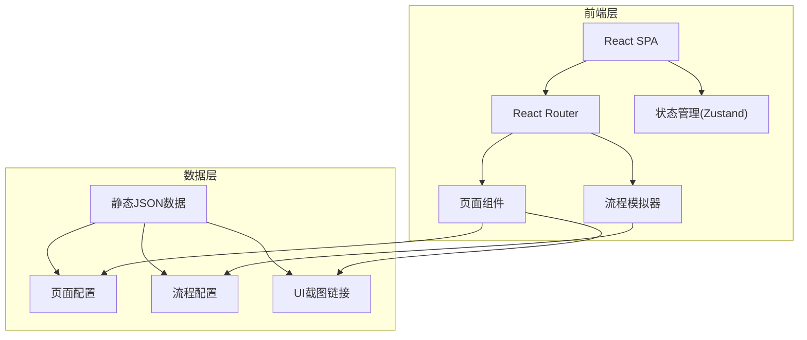

## 1. 架构设计



## 2. 技术说明

- **前端框架**：React@18 + TypeScript + Vite
- **样式方案**：Tailwind CSS@3
- **路由**：React Router@6
- **状态管理**：Zustand（轻量级，用于流程模拟器状态）
- **动画**：Framer Motion（页面切换动画、流程图动画）
- **流程图**：React Flow（交互式流程图）
- **后端**：无（纯静态数据）
- **数据库**：无（使用JSON静态数据）

## 3. 路由定义

| 路由 | 用途 |
|------|------|
| / | 导航首页，展示流程全景图和页面分类列表 |
| /page/:id | 页面详情页，展示单个页面的需求说明和UI截图 |
| /flow/:flowId | 流程模拟器，按步骤模拟用户操作流程 |
| /flow/:flowId/:stepId | 流程模拟器特定步骤 |

## 4. 数据模型

### 4.1 页面数据模型

```typescript
interface PageData {
  id: string;
  title: string;
  category: 'login' | 'register' | 'verify' | 'other';
  description: string;
  uiImages: string[];
  requirements: string[];
  interactions: string[];
  errorHandling: string[];
  prevPages: string[];
  nextPages: string[];
}
```

### 4.2 流程数据模型

```typescript
interface FlowData {
  id: string;
  name: string;
  description: string;
  steps: FlowStep[];
}

interface FlowStep {
  id: string;
  pageId: string;
  label: string;
  choices?: FlowChoice[];
}

interface FlowChoice {
  label: string;
  nextStepId: string;
}
```

## 5. 项目结构

```
src/
├── components/
│   ├── Layout/          # 布局组件（侧边栏、顶栏）
│   ├── FlowChart/       # 交互式流程图组件
│   ├── PageCard/        # 页面卡片组件
│   ├── PageDetail/      # 页面详情组件
│   ├── FlowSimulator/   # 流程模拟器组件
│   └── PhoneFrame/      # 手机模拟框组件
├── pages/
│   ├── Home/            # 导航首页
│   ├── PageView/        # 页面详情页
│   └── FlowView/        # 流程模拟页
├── data/
│   ├── pages.ts         # 页面配置数据
│   └── flows.ts         # 流程配置数据
├── store/
│   └── useFlowStore.ts  # 流程模拟器状态
├── App.tsx
└── main.tsx
```
